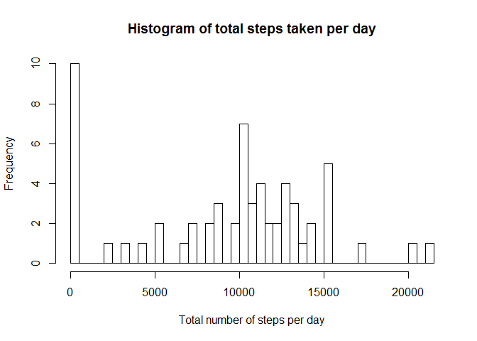
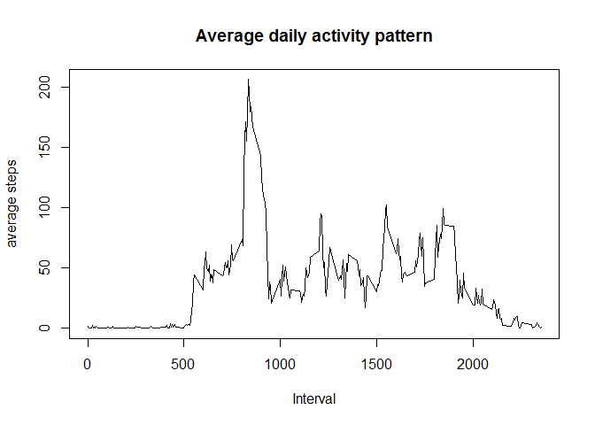
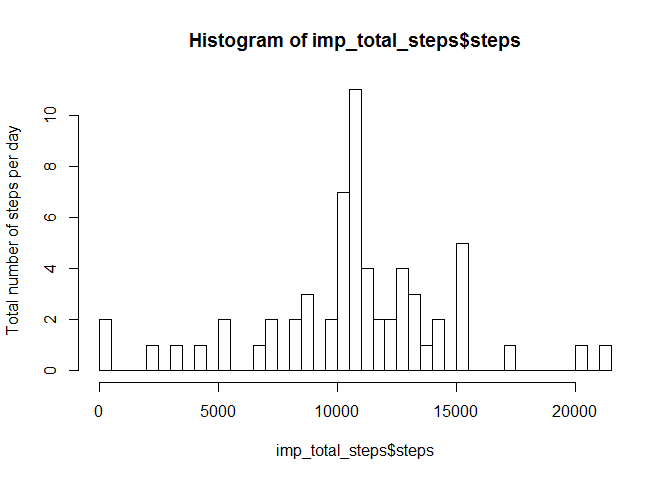
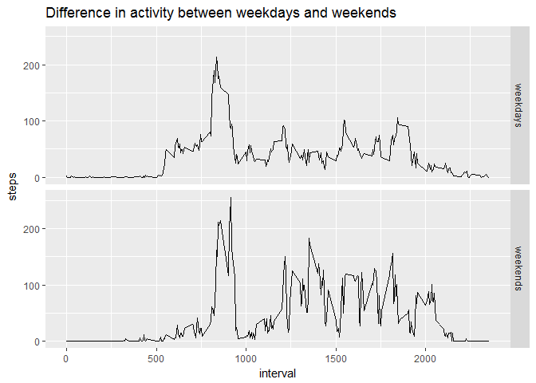

## Loading and preprocessing the data

```r
options(scipen = 1, digits = 2)
activity <- read.csv("data/activity.csv")
activity$date <- as.Date(activity$date)
```

## What is mean total number of steps taken per day?

```r
total_steps <- aggregate(steps ~ date, activity, sum, na.rm = TRUE, na.action=NULL)
hist(total_steps$steps, breaks=61, main = "Histogram of total steps taken per day", xlab = "Total number of steps per day")
```

<!-- -->

### Calculating the mean and the median

```r
steps_mean <- mean(total_steps$steps)
steps_median <- median(total_steps$steps)
```
* The mean total number of steps per day is:  9354.23
* The median total number of steps per day is:  10395

## What is the average daily activity pattern?

```r
act_avg <- aggregate(steps ~ interval, activity, mean)
plot(act_avg$interval, act_avg$steps, type = 'l', main = "Average daily activity pattern", xlab = "Interval", ylab = "average steps")
```

<!-- -->

```r
max_number_steps <- max(act_avg$steps)
row_number = which.max(act_avg$steps)
```

* Time interval 835 has, on average, the maximum number of steps: 206.17

## Imputing missing values

```r
missing_values <- sum(is.na(activity$steps))
imp_activity <- activity
for(i in 1:nrow(imp_activity))
        {
        interval <- activity[i,3]
        if (is.na(imp_activity[i,1]))
                 {
                 row_number <- which(act_avg$interval == interval)
                 imp_activity[i,1] <- act_avg$steps[row_number] 
                 }
}

imp_total_steps <- aggregate(steps ~ date, imp_activity, sum)
hist(imp_total_steps$steps, breaks=61, ylab = "Total number of steps per day")
```

<!-- -->

```r
imp_steps_mean <- mean(imp_total_steps$steps)
imp_steps_median <- median(imp_total_steps$steps)
```

* The number of missing values in the dataset is: 2304
* The missing values are imputed by the mean for that 5-minute interval
* The mean total number of steps per day is:  10766.19
* The median total number of steps per day is:  10766.19

Imputing missing values by the mean number of steps at a certain interval gives a higher mean total number of steps per day. This is due to the fact that a few dates contain only missing values, which lead to a higher amount of steps when imputing missing values

## Are there differences in activity patterns between weekdays and weekends?

```r
imp_activity$wd <- factor(ifelse(as.POSIXlt(activity$date)$wday %in% c(6:7), "weekend", "weekday"), labels=c("weekdays","weekends"))
imp_act_avg <- aggregate(steps ~ interval + wd, imp_activity, mean)
library("ggplot2")
g <- ggplot(imp_act_avg, aes(interval,steps)) + facet_grid(wd ~ .)
g + geom_line() + ggtitle("Difference in activity between weekdays and weekends")
```

<!-- -->
